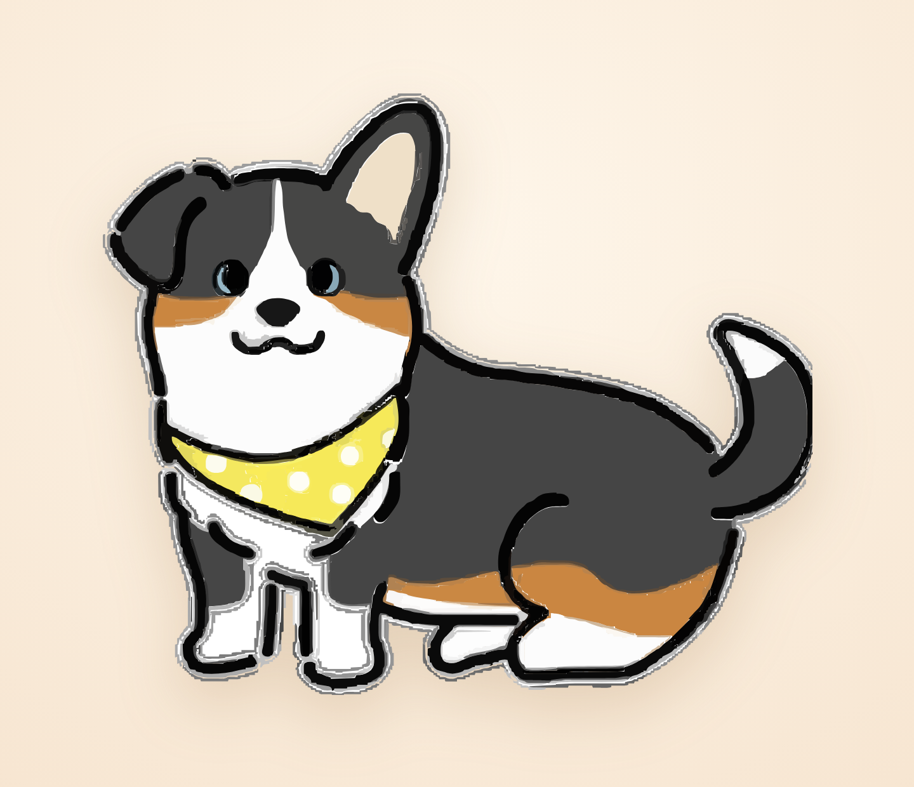

<div align="center">



# 🐶 Pixll — meet Lola

### the little corgi who lives in the corner of your screen

*Not a game. Not a chatbot. Just calm company while you work —*
*and a gentle nudge when it's getting late.* 🌙

<br/>


</div>

---

## 👋 Say hi to Lola

Lola is a **frameless, transparent, always-on-top** desktop pet. She sits wherever you leave her, breathes softly, and reacts when you say hello. No windows, no clutter — just a friend in the corner.

<div align="center">

</div>

## ✨ What she does

| | |
|---|---|
| 🖼️ **Floats on your desktop** | Transparent, borderless, always on top — only Lola shows, nothing else. |
| 🖱️ **Drag her anywhere** | Move her to your favorite corner — she remembers the spot next time. |
| 👋 **Click to say hi** | A little bounce and a warm one-liner. |
| 🌙 **Gentle reminders** | Low-key nudges to sip water, stretch, and wind down late at night — never a naggy system popup. |
| 🐶 **One-click menu-bar toggle** | Tuck her away with the **×**, bring her back from the **🐶** in your menu bar (or the Dock icon). |

## 🚀 Get Lola running

You'll need [Node.js](https://nodejs.org/) (LTS). Then:

```bash
git clone https://github.com/YilannDong/digital-lola.git
cd digital-lola
npm install     # grabs Electron
npm start       # 🐶 Lola appears!
```

On first launch, name her and hit **"Bring to desktop."** After that she comes right back every time — and lives quietly in your menu bar.

## 🎨 Make her your own

Lola is just an SVG — swap in *any* character:

```bash
# 1. drop your artwork at ~/Downloads/lola.svg
node tools/embed-lola.cjs   # bake it into the app
node tools/make-fill.cjs    # tidy up any transparent gaps
npm start                   # meet your new friend
```

> 💡 A **layered** SVG (ears, tail, etc. as separate groups) unlocks richer per-part animation down the road.

## 🧩 Under the hood

Plain HTML/CSS/JS in Electron — **no framework, no build step.**

```
src/
├─ main.js            windows · menu-bar tray · saving · reminders
├─ preload.js         safe IPC bridge
├─ renderer/
│  ├─ pet.*           the floating pet: drag · click · bubble · close
│  └─ builder.*       the "name & place her" screen
└─ shared/
   ├─ lola.js         Lola's artwork (embedded SVG)
   ├─ lola-fill.js    white backing that fills gaps in the trace
   ├─ pet-render.js   composes the artwork
   └─ messages.js     the gentle things she says
```

## 💛 License

[MIT](LICENSE) © 2026 Yilan Dong — go make your own desktop friend.

<div align="center">
<br/>
<sub>Built with Electron · a tiny bit of magic · and one very good dog.</sub>
</div>
